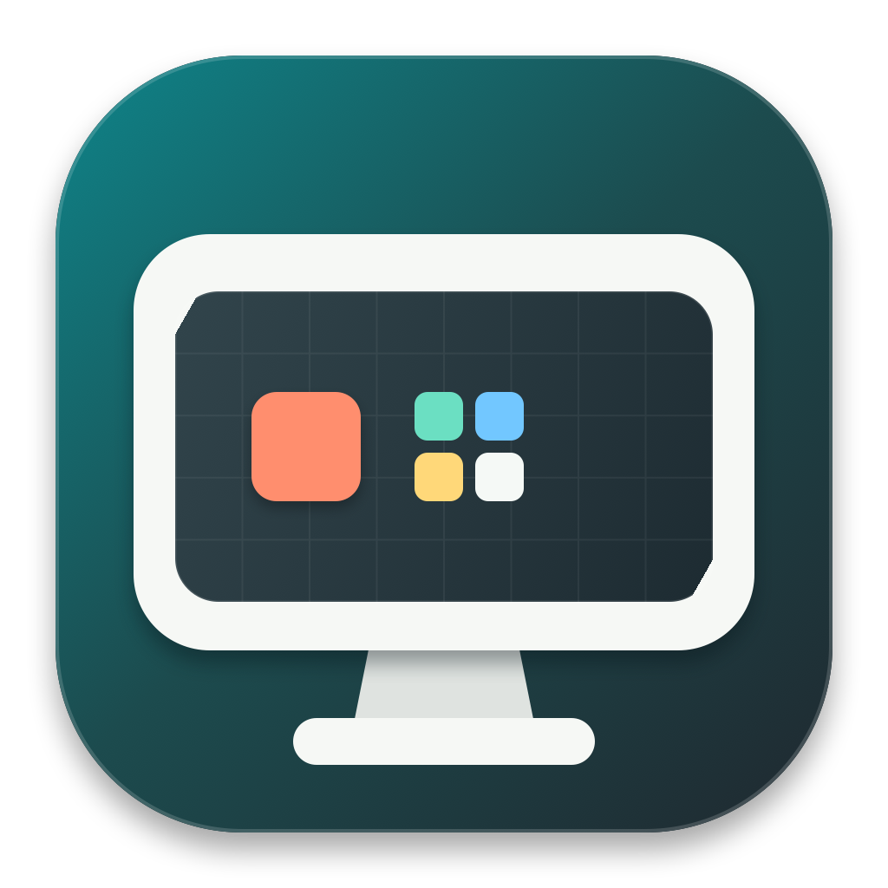

# Bird HiDPI

English | [简体中文](README.zh-CN.md)



Bird HiDPI is a lightweight native macOS menu bar utility for selecting HiDPI modes that WindowServer already provides for a real external display but System Settings may not expose.

> [!WARNING]
> This project relies on private macOS SkyLight APIs. A system update may break the app or require compatibility work, and the app is not suitable for Mac App Store distribution. Save ongoing work before switching display modes.

## Features

- Switches modes directly on the same physical display ID without creating a virtual display or mirrored desktop.
- Separates Standard and HiDPI modes and shows both logical resolution and framebuffer size.
- Lists only desktop-usable resolutions matching the panel's native aspect ratio.
- Tries to preserve the current refresh rate and pixel encoding.
- Verifies the framebuffer, online display set, and arrangement after switching, restoring immediately on failure.
- Restores the pre-app mode when Restore is clicked, the app quits, or the session ends normally.
- Installs no display override, changes no EDID, and requires neither administrator nor Screen Recording permission.
- Supports English, Simplified Chinese, Traditional Chinese, French, German, Italian, Spanish, Portuguese, Swedish, Norwegian Bokmål, Irish, and automatic system language matching.

For example, selecting 1920 x 1080 HiDPI on a native 2560 x 1440 display can make WindowServer render a 3840 x 2160 framebuffer and downsample it to the physical panel. This only works when the current macOS, GPU, and display connection already provide that mode; the app does not create new display modes.

## Requirements

- macOS 13 Ventura or later
- At least one real external display
- Xcode Command Line Tools, only when building from source

Available modes are determined by macOS, the GPU, cable/interface, and display. Resolution and refresh-rate lists can differ between machines.

## Installation

### Install From GitHub Releases

1. Download the latest `Bird-HiDPI-<version>-macos.zip` from [Releases](../../releases).
2. Extract it and move `Bird HiDPI.app` to Applications.
3. If macOS cannot verify the developer on first launch, Control-click the app in Finder and choose Open.

Current public builds are ad-hoc signed and are not yet signed with an Apple Developer ID or notarized. You do not need to disable Gatekeeper, and should not run quarantine-removal scripts from untrusted sources.

To verify a download, place the checksum next to the archive and run:

```sh
shasum -a 256 -c Bird-HiDPI-1.0.2-macos.zip.sha256
```

### Build From Source

```sh
git clone https://github.com/gcnyin/BirdHiDPI.git
cd BirdHiDPI
make test
make app
open "dist/Bird HiDPI.app"
```

## Usage

1. Click the display icon in the menu bar.
2. Turn HiDPI on or off.
3. Select a target logical resolution from the complete list.
4. Click Apply. Modes can still be changed directly while active.
5. Click Restore to return to the mode active before the app started.

The app applies a mode only to the current login session. It restores the original mode on normal exit, so keep the app running to continue using the selected mode.

## Safety And Recovery

A mode switch normally causes a brief black screen. After switching, the app verifies that the physical display remains online, the display set and arrangement are unchanged, and the actual framebuffer matches the requested mode. It attempts to restore the previous mode number if any check fails.

Because the underlying APIs are private, no guarantee can cover every macOS, GPU, and display combination against a WindowServer failure. If the picture does not recover automatically, log out and back in or reconnect the display. The `.forSession` configuration is not written as a permanent system configuration. Include the macOS version, Mac model, display model, connection type, target resolution, and refresh rate in bug reports.

See [SECURITY.md](SECURITY.md) for security reports. Use the GitHub issue templates for ordinary bugs.

## How It Works

The app reads the complete mode table through SkyLight's `CGSGetNumberOfDisplayModes` and `CGSGetDisplayModeDescriptionOfLength`. It then calls `CGSConfigureDisplayMode` by mode number inside a `CGBeginDisplayConfiguration` / `CGCompleteDisplayConfiguration` transaction on the original physical display.

The switch uses CoreGraphics `.forSession` scope. The app does not create a second display, start a ScreenCaptureKit stream, or write to `/Library/Displays`.

## Privacy

The app has no network functionality and collects no telemetry. It stores only the last selected output mode for each display and the app language preference in local `UserDefaults`.

## Development

Common commands:

```sh
make build       # Debug build
make test        # Localization validation and unit tests
make icon        # Regenerate AppIcon.png and AppIcon.icns
make app         # Build dist/Bird HiDPI.app
make release     # Build a versioned ZIP and SHA-256 file
```

The explicit integration test changes a real external display mode and is disabled by default:

```sh
RUN_DISPLAY_INTEGRATION_TEST=1 \
swift test --filter DisplayIntegrationTests/testResolutionAndHiDPIToggleEndToEnd
```

Read-only mode-table diagnostics also require explicit opt-in. Save your work before hardware tests and make sure you can recover the session by logging in again.

## Contributing

Read [CONTRIBUTING.md](CONTRIBUTING.md) before opening an issue or pull request. Release history is tracked in [CHANGELOG.md](CHANGELOG.md).

## License

This project is available under the [MIT License](LICENSE).
